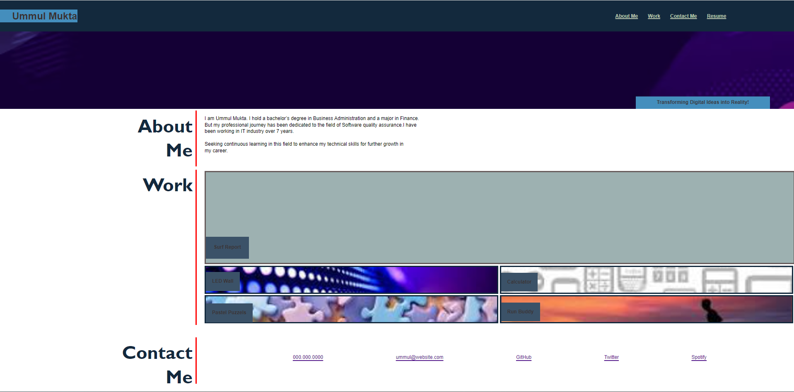

# Ummul-Portfollio
I aspire to enhance my career by delving into web development. Acquiring proficiency in HTML and  advance CSS is crucial for achieving my goals. While working on this project, I've acquired valuable insights into using s establishing a logical structure for CSS styling and positioning, and creating an effective webpage with CSS Selectors, positioning, box-model and advance css  and media query screen.

### Table of Contents (Optional)N/A

### Usage N/A

### Credits N/A

### MIT License 

### Badges N/A

###  https://github.com/UmmulColumbia/Ummul-Portfollio

### Screenshot:
